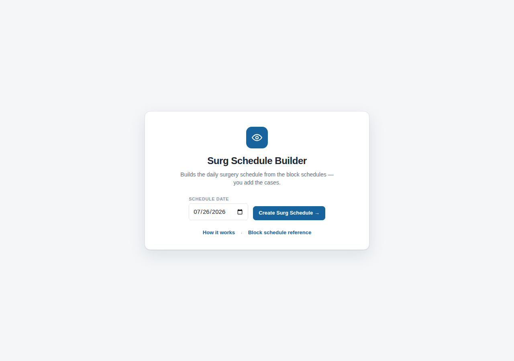
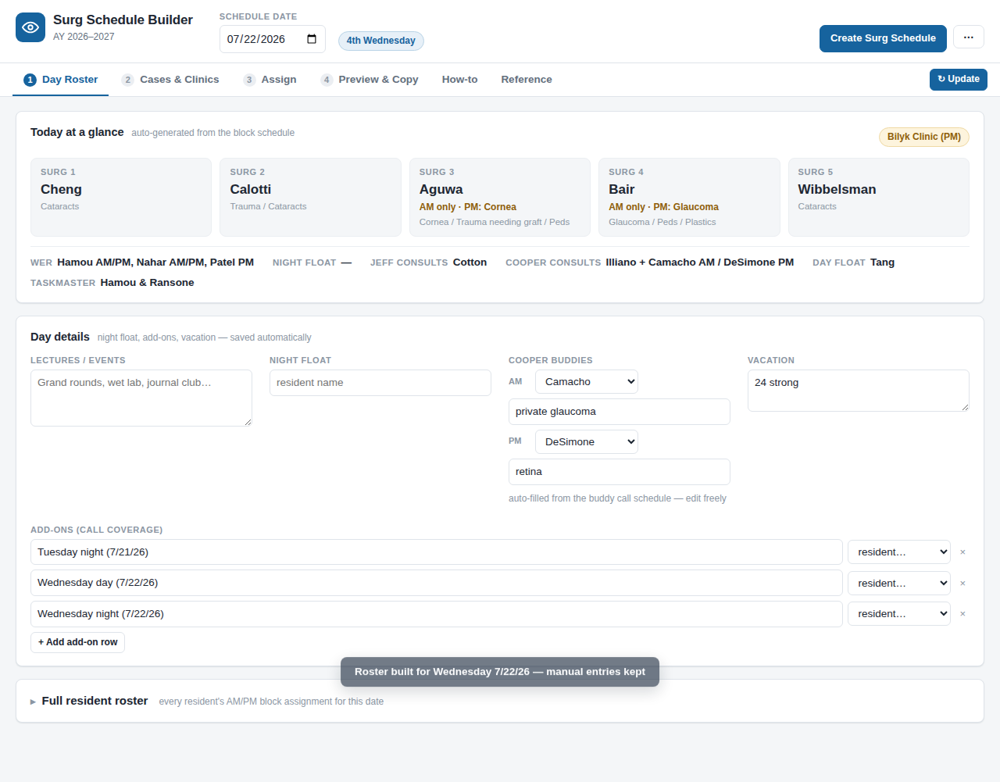
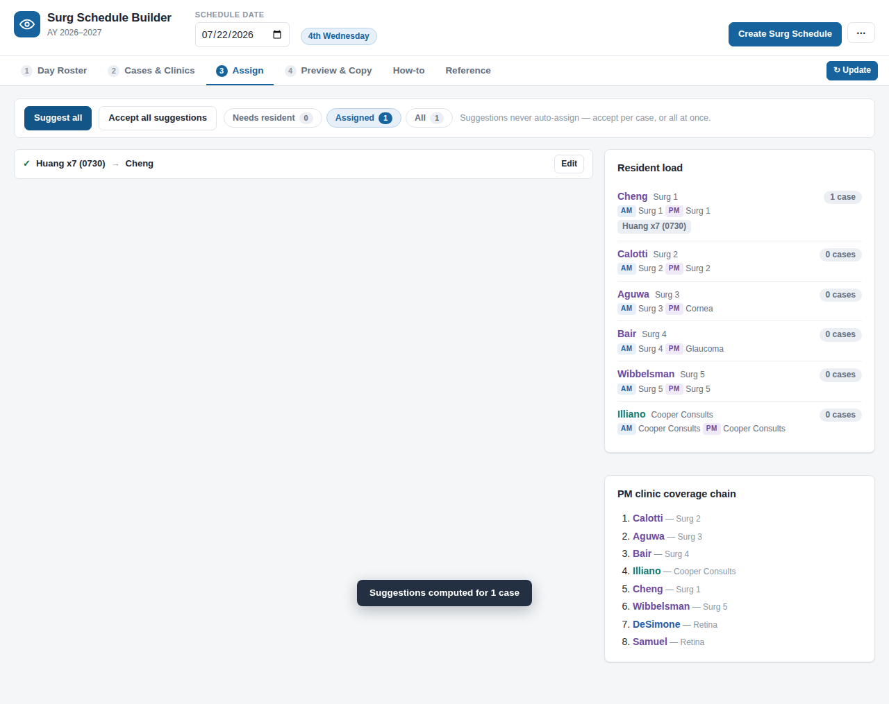

# Surg Schedule Builder

A lightweight web app that helps the chief residents build the **daily surgery
schedule** for an ophthalmology residency program. Pick a date and everything
derivable from the annual block schedules fills itself in — Surg 1–5, consult
and ER coverage, clinic staffing, Cooper buddy call. You add what only the
EMRs know (the case list and patient counts), press **Suggest**, and the app
proposes a resident for every case using the program's assignment hierarchy.
The finished schedule copies out in the exact document format the program
already uses.

**No install, no server, no accounts.** It's plain HTML/CSS/JS — open
`index.html` in any browser (or use the single-file build in `dist/`).
Everything you type stays in your own browser (localStorage), saved per date.



## What it does

| Automatic (from the block schedules) | Manual (from the EMRs / calendars) |
|---|---|
| Surg 1–5 assignments for any date | OR case list (surgeon, counts, start, service vs private) |
| WER, Jeff/Cooper Consults, Day Float, taskmasters | Clinic patient counts |
| Clinic staffing rosters (AM/PM) | Night float, vacation, lectures |
| Nth-weekday rules (Peds OR 4th Tues, Plastics OR 4th Wed, …) | Add-on call names |
| Cooper buddy call (template + named blocks) | Any override you want — nothing is locked |

- **Assign tab** applies the "How to Surgical Schedule" hierarchy: scheduled
  cornea → Surg 3, glaucoma → Surg 4, cataracts → Surg 1/5/Wills OR, peds →
  junior on Peds OR → …, trauma → Surg 2 first, remaining cases
  chronologically through Surg 2 → 3 → 4 → Cooper → 1 → 5 — with workload
  and clinic-conflict warnings, and clinic-coverage backup suggestions
  ("Calotti to cover glaucoma clinic during case if after 1 PM…").
  Suggestions never auto-assign; you accept or override each one.
- **Preview & Copy** renders the day in the standard document format and
  copies it with formatting for pasting into Google Docs, Word, or email.
- **Reference & How-to tabs** carry the full block grids, assignment chains,
  scheduling notes, and onboarding tips, so new schedulers don't need the
  binder.




## Quick start

- **Hosted**: open the GitHub Pages site (once enabled — see below).
- **One file**: download [`dist/surg-schedule.html`](dist/surg-schedule.html)
  and double-click it. The entire app is that one file — handy for hospital
  computers with no internet access.
- **From source**: clone the repo and open `index.html`. No build step.

Because state lives in each browser's localStorage, sharing a link shares the
app — never your entered data.

## Project structure

```
index.html            app shell (tabs, panels)
css/style.css         styling
js/data.js            ← ALL schedule knowledge lives here (see below)
js/engine.js          date → who-is-where resolution (blocks, overrides, nth-weekday)
js/assign.js          case classification + assignment/backup suggestions
js/export.js          document formatting + clipboard
js/app.js             UI controller and per-date persistence
tests/                plain-Node test suites (no dependencies)
tools/bundle.js       builds the single-file dist/surg-schedule.html
docs/                 architecture & UI specs, screenshots
.github/workflows/    GitHub Pages deployment
```

## New academic year

Every schedule fact is data, not code. The easiest path is the in-app
**Setup page** (Home → "Set up a new year", or the ⋯ menu → "Setup / new
year"): download the active configuration as `surg-schedule-config.json`,
edit or replace the data for the new year, and upload it back — no code
changes, no redeploy. Uploaded configurations are validated first and live
only in that browser (a "Remove imported configuration" button reverts to
the built-in data). The Setup page's danger zone also deletes all saved
schedule days, for handing the app to the next class fresh.

To change the built-in defaults instead, edit **`js/data.js`** — the same
object the Setup page exports:

- `years.pgy2/pgy3/pgy4`: resident lists, block-date ranges, weekly grids,
  footnote override rules (`nth` weekday / month scoped)
- `buddyCall`: Cooper buddy template + named ranges
- `nfSchedule`: weekly Night Float ranges from the call sheet
- `cpecSheet`: the CPEC surgical block schedule
- `hierarchy`, `schedulingNotes`, `specialClinics`, reference content

Transcribe the new year's PDFs into that one file and the whole app follows.
Run the tests afterwards to catch typos:

```
node tests/test-engine.js
node tests/test-assign.js
node tests/test-integration.js
```

The suites verify the engine against a fully known example day (7/22/2026)
plus block boundaries, override rules, and the assignment chains.

## Deploying / sharing

- `node tools/bundle.js` regenerates `dist/surg-schedule.html` (add `--bare`
  for host-wrapped environments).
- The **Deploy to GitHub Pages** workflow (Actions tab) publishes the app to
  `https://<owner>.github.io/surgery_schedule/`. First run enables Pages
  automatically (repo must be public).

## Privacy

The app contains the program's block schedules and resident/attending names —
the same information printed on the lounge wall. It contains **no patient
information**, and nothing you type into the app ever leaves your browser.
