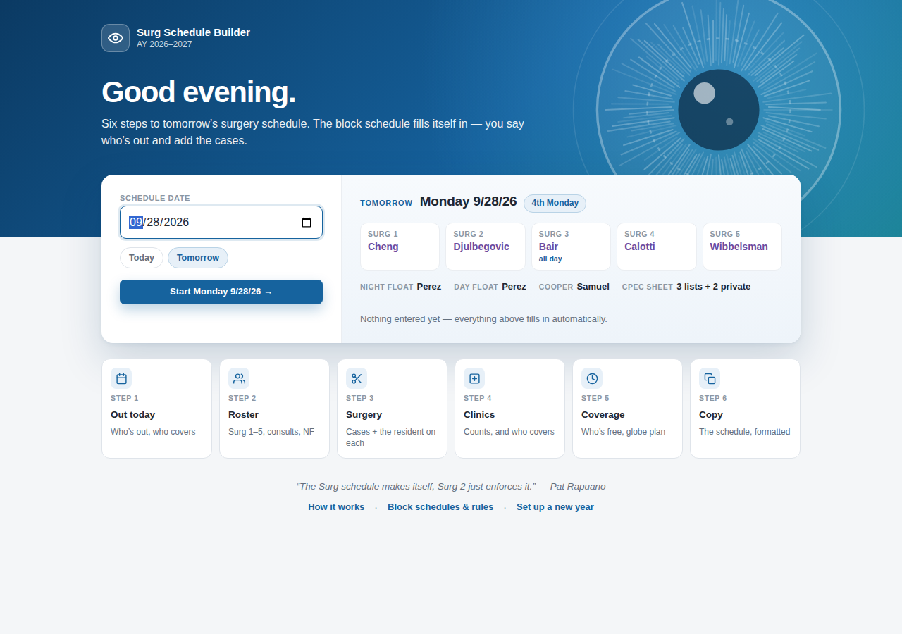
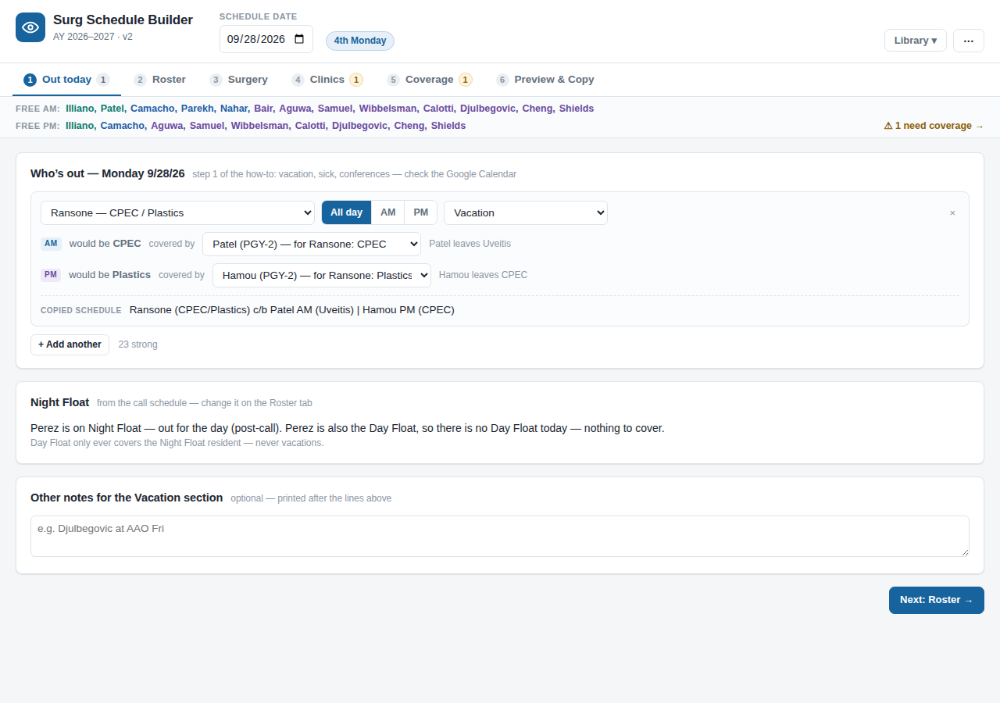
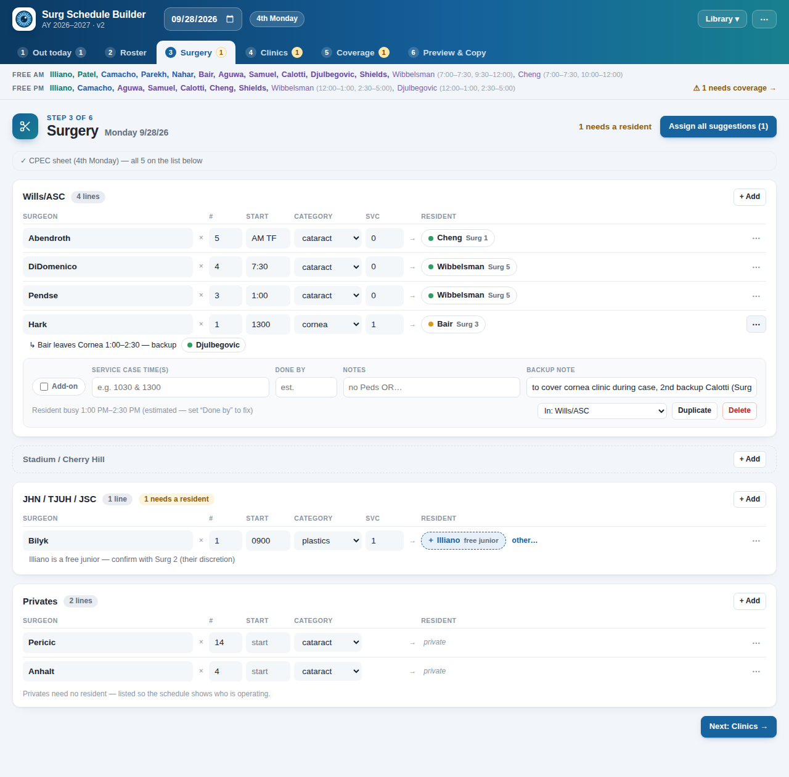
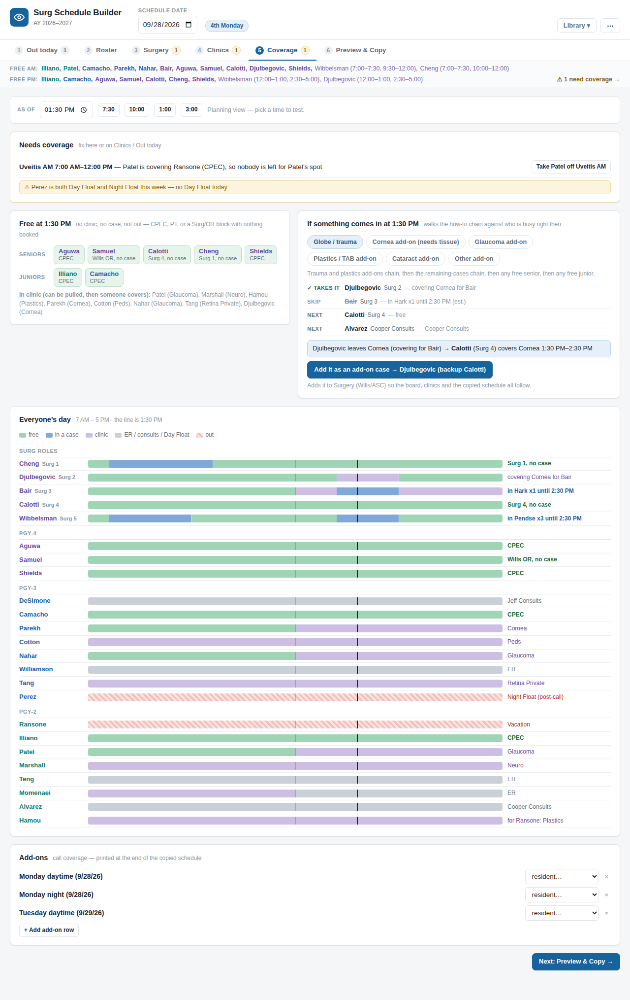

# Surg Schedule Builder

A lightweight web app that helps the chief residents build the **daily surgery
schedule** for an ophthalmology residency program. Pick a date and everything
derivable from the annual block schedules fills itself in — Surg 1–5, consult
and ER coverage, clinic staffing, Cooper buddy call. You say who is out, add
what only the EMRs know (the case list and patient counts), and the app
proposes a resident for every case using the program's assignment hierarchy —
skipping anyone who is out or already in a case at that time — and shows who
is free, and who covers whom, at any minute of the day. The finished schedule
copies out in the exact document format the program already uses.

**No install, no server, no accounts.** It's plain HTML/CSS/JS — open
`index.html` in any browser (or use the single-file build in `dist/`).
Everything you type stays in your own browser (localStorage), saved per date.



## What it does

| Automatic (from the block schedules) | Manual (from the EMRs / calendars) |
|---|---|
| Surg 1–5 assignments for any date | Who is out, and who covers each session (or NC) |
| WER, Jeff/Cooper Consults, Day Float, taskmasters | OR case list (surgeon, counts, start, service vs private) |
| Clinic staffing rosters (AM/PM) | Clinic patient counts |
| Nth-weekday rules (Peds OR 4th Tues, Plastics OR 4th Wed, …) | Lectures, add-on call names |
| Cooper buddy call, Night Float (from the call schedule) | Any override you want — nothing is locked |
| Who is free / in a case / in clinic at any time, and every clinic gap | |

The six tabs follow the "How to Surgical Schedule" order:

1. **Out today** — "No one out — 24 strong", or who is out (all day / AM /
   PM) and who covers each session, or NC. Prints as
   `Ransone (CPEC/Plastics) c/b Patel AM (Uveitis) | Hamou PM (CPEC)`.
   Anyone out disappears from every dropdown.
2. **Roster** — Surg 1–5 (Surg 3 and 4 all day), WER, consults, Night Float
   and the Day Float covering them.
3. **Surgery** — the CPEC-sheet cataracts, then the case list, with the
   resident picked on each case: a one-click suggestion that follows the
   how-to doc step by step (scheduled cornea → Surg 3, add-on glaucoma →
   Surg 4, …, trauma → Surg 2; anything skipped waits for Step 10, the
   remaining cases Surg 2 → 3 → 4 → Cooper → 1 → 5, in time order). It skips
   anyone out or already in a case then, never suggests anyone off the doc's
   chains (past the end it's Surg 2's call, and it shows who else is free),
   and the dropdown groups residents by free / in clinic / busy. When a case
   pulls someone out of clinic, the backup who covers it is suggested too.
   Nothing is assigned until you click.
4. **Clinics** — counts, plus who is out or pulled into a case and who
   covers; anything left short is listed on top.
5. **Coverage** — who is available AM and PM (free, or done with their
   service case; then Retina / Uveitis, the first to pull from — no cover
   needed; never Path), what happens if add-ons come in — one or several,
   each at its own time, placed in the doc's step order and searched
   exactly so none is left without a resident when some choice covers it
   (docs/OPTIMIZATION.md) — who covers a clinic if a morning OR runs late
   (free juniors first for a junior), add-on call names.
6. **Preview & Copy** — the day in the standard document format, copied
   with formatting for Google Docs, Word, or email.

A Free AM / Free PM strip stays under the tabs; How-to, the CPEC sheet, the
block grids and Setup live in the **Library** menu. The rules the app
encodes — and the assumptions still to calibrate — are listed in
[docs/UISPEC6.md](docs/UISPEC6.md).





## Versions

- **v2** (this version, 9/2026) — the flow follows the how-to (Out today →
  Roster → Surgery → Clinics → Coverage → Preview), the app knows who is
  free at any minute, the Surgery tab is one line per attending with the
  resident on the line, and the Coverage tab answers "a globe comes in —
  who takes it, who covers their clinic". Every rule, and every assumption
  still to calibrate: [docs/UISPEC6.md](docs/UISPEC6.md).
- **v1** — the original app, kept two ways: its exact source at commit
  [`29d8fa0`](https://github.com/Mak-Djulbegovic/surgery_schedule/tree/29d8fa0c5d68247da914be06cda35fbb9bb73b45) (main before v2), and
  [`v1/index.html`](v1/index.html), the whole v1 app in one file (on the
  hosted site at `/v1/`). See [v1/README.md](v1/README.md).

Days saved in v1 open in v2 (same browser, same storage keys).

## Quick start

- **Hosted**: open the GitHub Pages site (once enabled — see below).
- **One file**: download [`dist/surg-schedule.html`](dist/surg-schedule.html)
  and double-click it. The entire app is that one file — handy for hospital
  computers with no internet access.
- **From source**: clone the repo and open `index.html`. No build step.

Because state lives in each browser's localStorage, sharing a link shares the
app — never your entered data.

### Saving, and working at the same time as someone else

- **Autosave**: every edit is saved within 0.3 s, and again the moment the tab
  is hidden or closed (phones included). The header shows "✓ Saved 12:41 PM",
  or "⚠ Not saved" if the browser blocks storage (some private modes).
- **Closing the tab loses nothing**: the landing page offers "Pick up where
  you left off" (day + step), and the URL carries the day
  (`#/surgery/2026-09-28`), so a reloaded or restored tab reopens it.
- **Other people are never affected**: there is no server — each person's
  drafts live only in their own browser, so two residents building the same
  day on their own phones or computers never see or overwrite each other.
- **Taking over a day someone else built**: the Surg 2 who builds a day is
  often not that day's Surg 2. Paste the schedule you were sent (landing
  page, or Library → **Paste a sent schedule**): the app reads it back into
  that day — cases with residents and backups, who's out and who covers,
  Night Float, clinic counts and edits, add-on names — checks that it
  rebuilds the same schedule line for line, and saves it, so Coverage runs
  live in your browser and *Start from yesterday* can build tomorrow from
  it. It reads the hand-typed format in use (`- Reza x 7 (7:30AM start,
  service x 2 start @ 10:45AM): Calotti`, `c/b Patel AM (Uveitis)/NC d/s PM`,
  `Cornea PM (Meghpara, 28 x 2): …`) as well as the app's own. The case type
  isn't in the text, so you set it per case on the paste screen (pre-filled
  only from firm signals; the app remembers the type you set for each
  attending).
- **Same browser, two tabs** (or a shared workroom computer on one browser
  profile): these share storage. When one tab saves the day another tab has
  open, the other tab takes that version instead of later writing an old
  copy over it; if both have unsaved edits, it asks which to keep. On a
  shared computer, use your own browser profile (or your phone) so your
  drafts stay yours.

## Project structure

```
index.html            app shell (tabs, panels)
css/style.css         styling
js/data.js            ← ALL schedule knowledge lives here (see below)
js/engine.js          date → who-is-where resolution (blocks, overrides, nth-weekday)
js/status.js          who is out / in a case / in clinic / free, minute by minute
js/assign.js          case classification + availability-aware assignment/backup suggestions
js/export.js          document formatting + clipboard
js/importer.js        reads a pasted schedule back into a day (hand-off)
js/app.js             UI controller and per-date persistence
tests/                plain-Node test suites (no dependencies)
tools/bundle.js       builds the single-file dist/surg-schedule.html
v1/                   the archived v1 app (one file) — see v1/README.md
docs/                 architecture & UI specs, screenshots
.github/workflows/    GitHub Pages deployment
```

## New academic year

Every schedule fact is data, not code. The easiest path is the in-app
**Setup page** (Home → "Set up a new year", or the ⋯ menu → "Setup / new
year"): download the active configuration as `surg-schedule-config.json`,
edit or replace the data for the new year, and upload it back — no code
changes, no redeploy. Uploaded configurations are validated first and live
only in that browser (a "Remove imported configuration" button reverts to
the built-in data). The Setup page's danger zone also deletes all saved
schedule days, for handing the app to the next class fresh.

To change the built-in defaults instead, edit **`js/data.js`** — the same
object the Setup page exports:

- `years.pgy2/pgy3/pgy4`: resident lists, block-date ranges, weekly grids,
  footnote override rules (`nth` weekday / month scoped)
- `buddyCall`: Cooper buddy template + named ranges
- `nfSchedule`: weekly Night Float ranges from the call sheet
- `cpecSheet`: the CPEC surgical block schedule
- `hierarchy`, `schedulingNotes`, `specialClinics`, reference content
- `availability` (which assignments count as free / fixed duty) and
  `caseMinutes` (estimated minutes per case, used to guess when a resident
  is free again)

Transcribe the new year's PDFs into that one file and the whole app follows.
Run the tests afterwards to catch typos:

```
node tests/test-engine.js
node tests/test-assign.js
node tests/test-integration.js
node tests/test-status.js
node tests/test-coverage.js
node tests/test-vacation.js
node tests/test-import.js
```

The suites verify the engine against a fully known example day (7/22/2026)
plus block boundaries, override rules, and the assignment chains.

## Deploying / sharing

- `node tools/bundle.js` regenerates `dist/surg-schedule.html` (add `--bare`
  for host-wrapped environments).
- The **Deploy to GitHub Pages** workflow (Actions tab) publishes the app to
  `https://<owner>.github.io/surgery_schedule/`. First run enables Pages
  automatically (repo must be public).

## Privacy

The app contains the program's block schedules and resident/attending names —
the same information printed on the lounge wall. It contains **no patient
information**, and nothing you type into the app ever leaves your browser.
